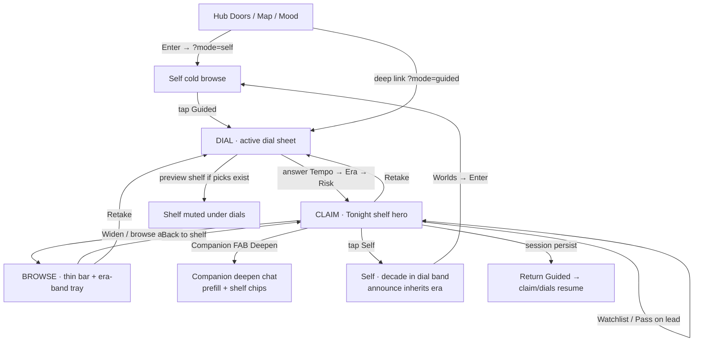

# Worlds Guided mode / tour — end-to-end UX audit

**Date:** 2026-08-06  
**Scope:** Guided tour only (Hub enter → dials → shelf → Watchlist/Pass → Widen → Retake/Back → Companion deepen → Self flip → Hub re-enter)  
**Worktree:** `immersive-curated-genre-specific-experie`  
**Live:** `:5173` UP · `:4000` UP (`libraryCount` 14+, TMDB+AI configured)  
**Evidence:** `docs/plans/_guided-tour-audit/` (`01`–`16`, plus `04b`/`05b`/`05c`/`09b`/`13b`/`14b`)  
**Skills:** ui-ux-pro-max (UX checklist) · arrange (squint / rhythm) · web-design-guidelines (Vercel WIG fetched) · design-taste (product UI, not landing)  
**Design read:** Guided is a **claim cockpit** inside an existing cinephile vault HUD — not a SaaS wizard. Variance mid, motion restrained, density high. Metaphor copy is intentional booth voice.

**Marcus note (internal):** Judge the path as a traveler judges a road — not by how pretty the milestones are, but whether each turn still knows where the night is going.

---

## Verdict

**Thought through in architecture. Incomplete in a few lived seams.**

Stage machine (`SEED → DIAL → CLAIM → (DEEPEN) → BROWSE`), Hub→Self cold enter, era-band Widen, Retake, Guided→Self era inherit, and Companion tour-prefill are real and mostly honest live. The tour is **not** fully end-to-end for touch Pass-on-peers, for the documented `deepen` HUD stage (dead wire), or for first-time discoverability of Guided from Hub. No trivial P0 code change in this pass — findings below are ranked for a fix wave.

---

## Happy path map

**Live walk (Horror, 2026-08-06):**

| Step | Evidence | Observed |
|------|----------|----------|
| Hub | `01-hub.png` | Doors; Enter href = `/genre/horror?mode=self` |
| Enter Self | `02-enter-self.png`, `14b` | Self tray + decade; Guided is a flip, not the door |
| Guided enter / resume | `03`, `16` | Complete session → claim H1 “The door is chosen”; Retake present |
| Watchlist | `04b` | Stays Guided; flash “Watchlisted…”; counters update; shelf reshuffles |
| Pass | `05` / `05c` | Lead Pass/Watchlist visible; peers poster-only until active |
| Widen | `06-widen.png` | Browse bar `Guided · archive · Now band`; timeline **only** 2010s/2020s |
| Back to shelf | `07` | Claim cockpit restored; Widen CTA returns; decade cleared from URL |
| Companion deepen | `08`, `09` | Panel “Deepen TOUR”; dial chips; prefill mid-tour; stage stays `claim` |
| Retake → dials | `09b`–`12` | Tempo/Era/Risk radios; Classic shelf = Duckling / Cremator / Black Sunday |
| Guided→Self | `13b` | Announce `Self · 1970s from Classic dial`; URL `?decade=1970s` |
| Hub re-enter | `14b` | Always Self; does **not** silent-resume Guided |

---

## Broken / confusing steps

### 1. Hub never enters Guided (product seam, not a bug)
Enter is explicitly `genreSelfEnterPath` → `?mode=self`. Correct for “never inherit silent Guided resume,” but the walk “enter Guided” is **two beats** (Enter → Guided). First-time users see Self warehouse first; Guided is a mode chip, not a door.

### 2. Secondary shelf Pass / Watchlist is desktop-hover shaped
Claim design: actions on **active** cell only; lead is default active (`05c`). Peers are art-led until hover/focus. **Title click also `open` + navigates to `/title/...`**, so the natural tap to “select” a peer leaves the tour. Touch / keyboard discoverability of Pass on #2/#3 is weak vs the copy “Tonight’s three · claim, pass, or re-dial.”

### 3. `deepen` stage is specified but unwired
`deriveGuidedStage` supports `deepenOpen`, and Claim parks `GenreModules` under `guidedHudStage === "deepen"`. Live Companion open **never** passes `deepenOpen` → stage stays `claim`; “Argue this pick” / parked argue body never appears. Deepen **as shipped** = Companion chat only. Copy (“deepen via the companion”) matches chat; stage machine docs over-promise.

### 4. Companion deepen vs Widen browse collision
Opening Companion from Widen (`09`) leaves **archive tray** behind a Deepen overlay. Dial chips still show parked answers, but the page stage is still browse — two “primaries” (tray + deepen novel). Arrange squint: V1 no longer one job.

### 5. Hero numeral still competes on claim / dial
Guided demotes world name to eyebrow, but Cabinet count (**83**) remains a large ghost on the same fold as Tour H1 (`03`, `09b`, `12`). Squint: two heroes (numeral vs “The door is chosen” / “Stand at the door with me”).

### 6. Dial chrome redundancy / transient gold
On Retake (`09b`): needle says Tempo **UP NEXT** while sheet says **TEMPO · 1 OF 3**; flash “Tour reframed…” and choose-cue both fight for the same attention band. One radio showed gold border before commit (focus/selection ambiguity).

### 7. Lead “thesis” sometimes reads as synopsis
Shelf lead line can be long overview-voice (`03` Evil Dead Burn TMDB blurb with em-dash; later picks often stronger). When argument thesis missing, claim fold feels like a catalog card, not a curator claim.

### 8. Mode URL honesty after flips
Guided→Self drops `mode` from URL (`?decade=1970s` only). Hub Enter sets `mode=self` then decade sync may drop it. WIG: stateful UI should stay deep-linkable; Guided is OK (`mode=guided`), Self is leaky.

---

## Blind angles

| Angle | What we know | Gap |
|-------|----------------|-----|
| **Resume** | Session persists; claim resume H1 + dials; once-per-tab resume whisper via `sessionStorage` | Whisper easy to miss / already spent in long sessions; no Hub “Continue tour” |
| **Empty vault shelf** | Romance `0 on shelf` still runs full dials (`15`) — niche = catalog `< 6`, not vault heat | Empty **vault** ≠ SEED; user may expect “seed the room” when shelf heat is empty |
| **SEED stage** | Implemented for `isSeedWorld && answeredCount===0` | Hard to hit on live catalog-rich worlds; under-validated live |
| **API fail** | Error pack: “Tour desk unavailable. Stay in Self mode, or retry Guided.” | Not broken live today; no Retry control, no `aria-live` escalation beyond alert role |
| **First-time vs return** | First: Self door → discover Guided chip. Return: silent claim resume | Return is strong; first-time Guided discovery is weak |
| **Movies ↔ TV mid-tour** | Media switch clears decade; guided session keyed by mediaType | Separate tours — fine, but no toast that TV is a fresh desk |
| **Retake vs re-tune** | Retake clears all; dial needle re-opens one beat | Clear once you know; labels “RETAKE” vs “Tap to re-tune” easy to conflate |
| **Watchlist reshuffle** | Act removes/reorders shelf (`04b`) | Lead jumps under the cursor; Pass target can vanish mid-gesture |
| **prefers-reduced-motion** | Framer paths gated in GuidedTour | Not re-verified in this walk |

---

## What’s strong

1. **One primary surface per stage (mostly)** — Claim lacquer parks Self warehouse; Widen collapses desk to browse-bar. Mode-split holds live.
2. **Era band honesty on Widen** — Now → 2010s/2020s only (`06`); Classic claim shelf lands pre-1990 titles (`12`). Dial owns era; scrub doesn’t lie.
3. **Guided→Self inherit** — `Self · 1970s from Classic dial` (`13b`) is rare, excellent cross-mode storytelling.
4. **Hub cold enter = Self** — Prevents silent Guided resume on Enter; intentional and documented in `guidedStage.ts`.
5. **Curator copy register** — Metaphor-tied H1s, dial nouns, outcome whispers, complete guide line. Distinctive, not SaaS wizard.
6. **Companion tour prefill** — Mid-tour sentence + “Defend tonight’s three” chips (`08`) make deepen feel shelf-bound.
7. **a11y bones** — Radiogroup + arrow keys, progressbar, focus restore after answer, `aria-live` feedback, icon labels on Watchlist/Pass.
8. **Retake is real** — Clears dials, collapses Widen, reframes shelf (`09b` → dial 0).

---

## Skill lenses (short)

**Arrange / squint:** Claim fold is mostly one composition; hero numeral + Tour H1 still double-hero. Widen+Companion is the worst rhythm break.

**WIG:** Focus rings and labels mostly pass; secondary actions fail “interactive completeness” on touch; URL state incomplete on Self; error pack needs a Retry action; loading uses pulse skeletons (ok).

**Taste / anti-slop:** Booth voice works; avoid letting TMDB overview steal claim thesis; keep gold ration (Enter / accent CTA) — Retake uppercase mist is correctly quiet.

**ui-ux-pro-max UX:** Touch targets on lead Watchlist OK; peer Pass discoverability and loading/error recovery are the main CRITICAL-category gaps.

---

## Ranked fixes + opportunity features (max 8)

| Rank | Type | Item | Why |
|------|------|------|-----|
| **1** | Fix P1 | **Peer claim without navigate** — long-press / separate “Select” / actions on focus without firing `open`+route | Tonight’s three is the product; touch can’t Pass #2/#3 safely |
| **2** | Fix P1 | **Wire or delete `deepen` stage** — Companion open → `deepenOpen` + Argue details, **or** remove deepen from stage docs/copy | Dead stage is worse than chat-only deepen |
| **3** | Fix P1 | **Park Companion over claim only; from Widen, “Back to shelf” then deepen — or collapse Widen on open** | One job per V1 |
| **4** | Fix P2 | **Quiet Guided hero numeral** (or hide count in claim/dial) | Squint: Tour H1 must win |
| **5** | Fix P2 | **Hub Guided affordance** — door secondary “Guided →” or post-enter once-chip “Walk with me” | First-time path matches the happy-path map |
| **6** | Fix P2 | **Claim thesis fallback** — never raw overview; prefer argument / short curator line / omit | Claim fold stays claim |
| **7** | Opp | **Hub “Continue tour”** when session active/complete | Return users skip Self flip |
| **8** | Opp | **Empty-vault Guided preface** when shelf heat = 0 but catalog live — soft SEED copy without blocking dials | Aligns Hub “No shelf” with tour desk |

**Out of max-8 (park):** API Retry button; TV mid-tour toast; dial needle/sheet copy collapse; Self `mode=self` URL stickiness.

---

## Evidence index

| File | Moment |
|------|--------|
| `_guided-tour-audit/01-hub.png` | Worlds doors |
| `02-enter-self.png` | Hub Enter → Self |
| `03-guided-enter.png` | Guided claim resume |
| `04b-watchlist-stay.png` | Watchlist stays Guided |
| `05c-second-focus.png` | Peer cell no actions |
| `06-widen.png` | Archive · Now band |
| `07-back-shelf.png` | Collapse Widen |
| `08-deepen-companion.png` | Companion deepen |
| `09b-retake-dials.png` | Retake → Tempo |
| `10`–`12` | Dial → claim Classic shelf |
| `13b-flip-self.png` | Era inherit announce |
| `14b-hub-self-enter.png` | Hub re-enter Self |
| `15-romance-guided.png` | 0 vault shelf still dials |
| `16-horror-resume.png` | Guided resume claim |

---

## Success criteria for a “tour is thought through” sign-off

1. User can claim any of the three without leaving the page (mouse + touch).  
2. Deepen is one coherent surface (chat and/or argue) with a live stage bit.  
3. Widen and Companion never stack as dual primaries.  
4. First-time Guided is reachable without tribal knowledge of the mode chip.  
5. Resume + Retake + Hub Self enter remain as honest as they are today.

Until 1–4 land, call Guided **architecturally strong, interaction-complete only on the lead-cell happy path.**
