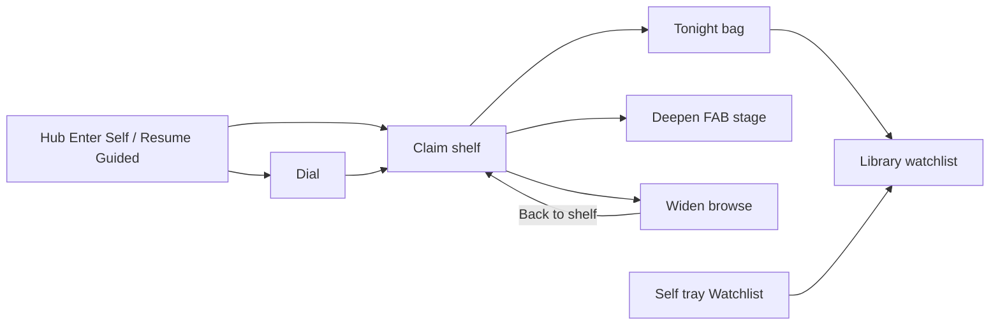

# Worlds Claim Loop — Partial to Complete

> **For agentic workers:** REQUIRED SUB-SKILL: Use superpowers:subagent-driven-development (recommended) or superpowers:executing-plans to implement this plan task-by-task. Steps use checkbox (`- [ ]`) syntax for tracking.
>
> **Plan file (on approve):** write full copy to [`docs/superpowers/plans/2026-08-06-worlds-claim-loop-complete.md`](docs/superpowers/plans/2026-08-06-worlds-claim-loop-complete.md) in the Worlds worktree (create `docs/superpowers/plans/` if missing). Daniel runs git himself — never auto-commit; end each task at “ready for Daniel commit.”

I'm using the **writing-plans** skill to create this implementation plan.

**Goal:** Close the Guided claim loop so a user can Enter → Guided → bag titles → open Library → return to Claim (and bag from Self) without hover traps, twin Companions, or invisible Watchlist writes.

**Architecture:** Keep Mode-split B stage machine (`SEED → DIAL → CLAIM → DEEPEN → BROWSE`). Add a Claim exit ritual (Tonight bag → `/library?status=watchlist`), wire `deepenOpen` into `deriveGuidedStage`, make Hub Resume explicit, unify peer/Self claim actions, finish Self↔Guided era inherit both ways, and tighten Guided shelf ranking for seed honesty. Packing/fold targets stay closed.

**Tech Stack:** React 19 + TS, Vite client, existing `api.guidedAct` / `actOnGuidedPick` / `addToLibrary`, Vitest, Instrument Ink Worlds chrome.

## Global Constraints

- Worktree only: `immersive-curated-genre-specific-experie` (live `:5173` / API `:4000`; agents may start/restart servers).
- **No packing reopen** — Mode-split B length targets remain GREEN; no warehouse remounts on Claim.
- **No silent Guided resume** — Hub cold Enter stays `?mode=self`; Resume is an explicit second chip.
- **One deepen verb in-world** — desk Deepen stays dead; FAB is sole chat on `/genre/:slug`; Shell Companion must not read as a peer Deepen.
- **Gold ration** — world-accent for in-world verbs; gold brand/live only.
- **Daniel runs git** — no agent commits; tasks end with “ready for Daniel commit.”
- Anti-scope: mood/atlas factories, dual Deepen CTAs, social, module sprawl as P0, Mode-split redesign.

## Spec coverage (Must → tasks)

| Must | Task(s) |
|------|---------|
| Tonight bag → Library | T1–T2 |
| Claim as home + Hub Resume | T3–T4 |
| Touch-safe peer claim | T5 |
| One deepen verb | T6–T7 |
| Self Watchlist | T8 |
| Era continuity | T9 |
| Shelf trust | T10 |
| Definition-of-done live QA | T11 |

## File map

| File | Role |
|------|------|
| [`client/src/components/genre/guidedStage.ts`](client/src/components/genre/guidedStage.ts) | Stage derive + enter paths (`genreSelfEnterPath`, add `genreGuidedResumePath`) |
| [`client/src/components/genre/GuidedTour.tsx`](client/src/components/genre/GuidedTour.tsx) | Shelf acts, Tonight bag UI, peer tap, deepenOpen prop, Claim-home |
| [`client/src/pages/GenreExperience.tsx`](client/src/pages/GenreExperience.tsx) | Wire deepenOpen, era inherit both ways, Self Watchlist actions |
| [`client/src/components/genre/CompanionPanel.tsx`](client/src/components/genre/CompanionPanel.tsx) | Report open state; sole in-world chat |
| [`client/src/components/Shell.tsx`](client/src/components/Shell.tsx) | On genre routes: label Archive chat / open deepen, not twin Deepen |
| [`client/src/pages/GenrePicker.tsx`](client/src/pages/GenrePicker.tsx) + [`WorldsMap.tsx`](client/src/components/genre/WorldsMap.tsx) | Resume Guided chip |
| [`client/src/components/genre/GenreModules.tsx`](client/src/components/genre/GenreModules.tsx) | Self active-title Watchlist/Pass |
| [`server/src/services/guidedSessionService.ts`](server/src/services/guidedSessionService.ts) | Shelf ranking / seed trust (T10) |
| Tests: `GuidedTour.test.tsx`, `guidedStage.test.ts`, `GenreModules.test.tsx`, `CompanionPanel.test.tsx`, new bag/handoff tests |

---

### Task 1: Tonight bag model + Library deep-link helper

**Files:**
- Create: `client/src/components/genre/tonightBag.ts`
- Create: `client/src/components/genre/tonightBag.test.ts`
- Modify: `client/src/lib/api.ts` only if a typed helper for library URL is needed (prefer pure client helper)

**Interfaces:**
- Produces: `libraryWatchlistPath(): string` → `"/library?status=watchlist"`
- Produces: `TonightBagItem { tmdbId, mediaType, title, posterPath? }`
- Produces: `buildTonightBag(picks, actedWatchlistIds): TonightBagItem[]`

- [x] **Step 1: Write failing tests** for `libraryWatchlistPath` and bag builder (only titles watchlisted this session / marked inLibrary after act).
- [x] **Step 2: Run** `npx vitest run client/src/components/genre/tonightBag.test.ts` — expect FAIL.
- [x] **Step 3: Implement** pure helpers (no React).
- [x] **Step 4: Re-run tests** — PASS.
- [x] **Step 5: Ready for Daniel commit** — `feat(worlds): tonight bag helpers + library watchlist path`

---

### Task 2: Claim exit ritual UI (Tonight bag)

**Files:**
- Modify: `client/src/components/genre/GuidedTour.tsx` (after successful `watchlist` act, and when session complete with ≥1 bagged)
- Modify: `client/src/components/genre/GuidedTour.test.tsx`
- Modify: `client/src/components/genre/guidedCurator.ts` if cue copy moves into bag

**Interfaces:**
- Consumes: `buildTonightBag`, `libraryWatchlistPath` from T1
- Produces: `data-testid="tonight-bag"` with primary CTA linking to Library; secondary “Stay on shelf”

**Behavior:** After Watchlist succeeds, show bag strip: claimed title(s) + **Open in Library** (`<Link to={libraryWatchlistPath()}>`). Whisper may stay; bag is the closing ritual. Do not navigate automatically.

- [x] **Step 1: Failing test** — mock `guidedAct` watchlist success → assert `tonight-bag` + Library link href.
- [x] **Step 2: Run test** — FAIL.
- [x] **Step 3: Implement** bag UI inside claim-stage (not a second lacquer card; hairline pane under shelf).
- [x] **Step 4: Tests PASS**; browser Claim Watchlist → bag visible.
- [x] **Step 5: Ready for Daniel commit**

---

### Task 3: Claim as home (collapse sticky Widen on Guided return)

**Files:**
- Modify: `client/src/pages/GenreExperience.tsx` — on entering Guided mode / remount with `status===complete`, force `guidedWiden=false` unless user just clicked Widen this session
- Modify: `client/src/components/genre/guidedStage.ts` tests if needed
- Modify: tests covering mode flip + Guided remount

**Behavior:** Completed Guided always paints Claim first. Widen only while `guidedWiden===true` set by explicit Widen CTA. Mode flip Guided→Self→Guided clears widen (already partial — lock it with a test).

- [ ] **Step 1: Failing test** — complete session + widen true + remount Guided → stage claim / browse-bar absent until Widen.
- [ ] **Step 2–4: Implement + PASS**
- [ ] **Step 5: Ready for Daniel commit**

---

### Task 4: Hub Resume Guided chip

**Files:**
- Modify: `client/src/components/genre/guidedStage.ts` — add `genreGuidedResumePath(slug) => `/genre/${slug}?mode=guided``
- Modify: `client/src/pages/GenrePicker.tsx` (WorldDoor cards)
- Modify: `client/src/components/genre/WorldsMap.tsx` if Enter strip exists
- Modify: `guidedStage.test.ts`, GenrePicker tests
- Need session presence: use existing hub/world summary or lightweight `api` check — prefer existing world list fields if session active/complete is already fetched; otherwise add minimal `hasGuidedSession` from current hub payload without new packing UI

**Behavior:** Every door keeps **Enter** → `genreSelfEnterPath`. When Guided session exists for that slug, show mist chip **Resume tour** → `genreGuidedResumePath`. Never make Enter silent-resume.

- [ ] **Step 1: Unit test** path helper + door renders Resume when session flag true.
- [ ] **Step 2–4: Implement + PASS**; live Hub Horror shows both chips when session exists.
- [ ] **Step 5: Ready for Daniel commit**

---

### Task 5: Touch-safe peer claim

**Files:**
- Modify: `client/src/components/genre/GuidedTour.tsx` `renderShelfPick`
- Modify: `GuidedTour.test.tsx`

**Behavior:** Peer poster **first tap/click = activate only** (`setShelfActiveKey`). Second tap / explicit “Open” opens title. Watchlist/Pass remain on active cell (W2.3). Remove `action: "open"` + `onOpenTitle` from the first peer select handler.

- [ ] **Step 1: Failing test** — click inactive peer → active actions appear; `guidedAct` not called with `open`; no navigation.
- [ ] **Step 2–4: Implement + PASS**
- [ ] **Step 5: Ready for Daniel commit**

---

### Task 6: Wire `deepenOpen` into stage machine

**Files:**
- Modify: `GuidedTour.tsx` — accept `deepenOpen: boolean`, pass into `deriveGuidedStage`
- Modify: `GenreExperience.tsx` — lift CompanionPanel open state (or callback) into `deepenOpen`
- Modify: `CompanionPanel.tsx` — `onOpenChange?: (open: boolean) => void`
- Modify: `guidedStage.test.ts`, `GuidedTour.test.tsx`, `CompanionPanel.test.tsx`

**Behavior:** Opening FAB after complete → `guidedHudStage === "deepen"` so claim-argue modules can mount per existing gate. Closing FAB → back to `claim`. Widen still wins over deepen if both set (browse takes priority in derive — keep that; closing widen returns claim then deepen if still open).

- [ ] **Step 1: Failing test** — `deepenOpen: true` + complete → stage `deepen`.
- [ ] **Step 2–4: Wire + PASS**; live open FAB on Claim → stage deepen.
- [ ] **Step 5: Ready for Daniel commit**

---

### Task 7: One companion verb (Shell on genre routes)

**Files:**
- Modify: `client/src/components/Shell.tsx`
- Optional: small event `lumina:open-world-companion` listened in `CompanionPanel` / `GenreExperience`

**Chosen approach (locked):** On `/genre/:slug`, Shell nav item label = **Archive chat** (still `/chat`) — copy makes split explicit. FAB remains **Deepen** / **Talk**. Do not navigate Shell Companion into FAB (keeps archive chat reachable). No second Deepen CTA on the desk.

- [ ] **Step 1: Test or RTL** — when path matches genre slug, nav accessible name is Archive chat not Companion.
- [ ] **Step 2–4: Implement + PASS**
- [ ] **Step 5: Ready for Daniel commit**

---

### Task 8: Self Watchlist on active title

**Files:**
- Modify: `GenreModules.tsx` (Featured / inspect pane) or tray active cell
- Modify: `GenreExperience.tsx` — wire `api.guidedAct` or shared library act API used by Guided (prefer same `guidedAct` if session required; else reuse library add endpoint already used server-side)
- Check `api.ts` for direct library add; if Guided-only, use the same server `addToLibrary` path via existing client method

**Behavior:** Mirror W2.3 — actions only on focused Self title (Featured inspect). Watchlist / Pass. After Watchlist, reuse Tonight bag link pattern (or compact “In Library” + link).

- [ ] **Step 1: Failing GenreModules/Experience test**
- [ ] **Step 2–4: Implement + PASS**; live Self bag one title → Library.
- [ ] **Step 5: Ready for Daniel commit**

---

### Task 9: Era continuity Self → Guided

**Files:**
- Modify: `GenreExperience.tsx` mode flip
- Modify: tests for flip announce / dial seed

**Behavior (locked):** Guided→Self already restores last Self decade or dial-band seed. **Self→Guided:** if Self has `decade` set, pre-select era dial band that contains that decade (classic/turn/now) when opening Guided (without wiping a completed session’s answers — only when starting/retuning dial phase, or set preferred band for ranking when session complete and user Retunes). Minimum: entering Guided from Self with decade=1980s lands Classic band context for Widen/claim ranking honesty.

- [ ] **Step 1: Failing test** for band mapping helper + flip effect
- [ ] **Step 2–4: Implement + PASS**
- [ ] **Step 5: Ready for Daniel commit**

---

### Task 10: Shelf trust (Guided ranking honesty)

**Files:**
- Modify: `server/src/services/guidedSessionService.ts` (and rank helpers)
- Server/client tests for picks including seed/classic titles when dial Classic

**Behavior:** When era dial is Classic (or world seed list exists), Tonight shelf must include ≥1 recognizable seed/prestige title from world seeds or catalog anchors — not three random popularity hits that break “named classics” trust. Keep page length caps from density work; adjust ranking weights / seed injection surgically.

- [ ] **Step 1: Failing server test** — Classic Horror shelf includes at least one seed anchor from world config.
- [ ] **Step 2–4: Implement minimal seed injection + PASS**
- [ ] **Step 5: Ready for Daniel commit**; live Classic Claim sniff titles feel intentional.

---

### Task 11: Definition-of-done live QA

**Files:**
- Create: `docs/plans/2026-08-06-worlds-claim-loop-dod.md` (checklist results)
- Update: canvas or status board note COMPLETE vs PARTIAL

**Live script @ 1440×900:**
1. Hub Enter Horror → Self
2. Resume tour (if session) → Claim
3. Dial → Watchlist two titles → Tonight bag → Open Library (items present)
4. Peer tap activates without leaving; Watchlist on peer
5. Deepen FAB → stage deepen; Shell says Archive chat
6. Widen → Back to shelf → Claim
7. Self Watchlist active title → Library
8. Flip era continuity both ways
9. Classic Claim shelf feels seeded

- [ ] **Step 1: Run script**; fix only P0 breaks found
- [ ] **Step 2: Mark product COMPLETE for claim-loop** (Trust axis expected ↑; packing unchanged)
- [ ] **Step 3: Ready for Daniel AMAZING-OR-NAH re-judge**

---

## Self-review

1. **Spec coverage:** All seven Musts mapped to T1–T10; DoD = T11. Should-items (durable Pass, Claim Export, deepen-acts-from-chat) explicitly out of this plan.
2. **Placeholders:** None — paths and behaviors locked (Shell = rename Archive chat; peer = activate-first; bag = non-auto navigate).
3. **Types:** `deepenOpen` already on `DeriveGuidedStageArgs`; `genreGuidedResumePath` new sibling to `genreSelfEnterPath`.

## Execution handoff

After this plan is approved and saved to `docs/superpowers/plans/2026-08-06-worlds-claim-loop-complete.md`:

**1. Subagent-Driven (recommended)** — fresh subagent per task + review between tasks (`subagent-driven-development`)

**2. Inline Execution** — `executing-plans` with checkpoints

Which approach?
